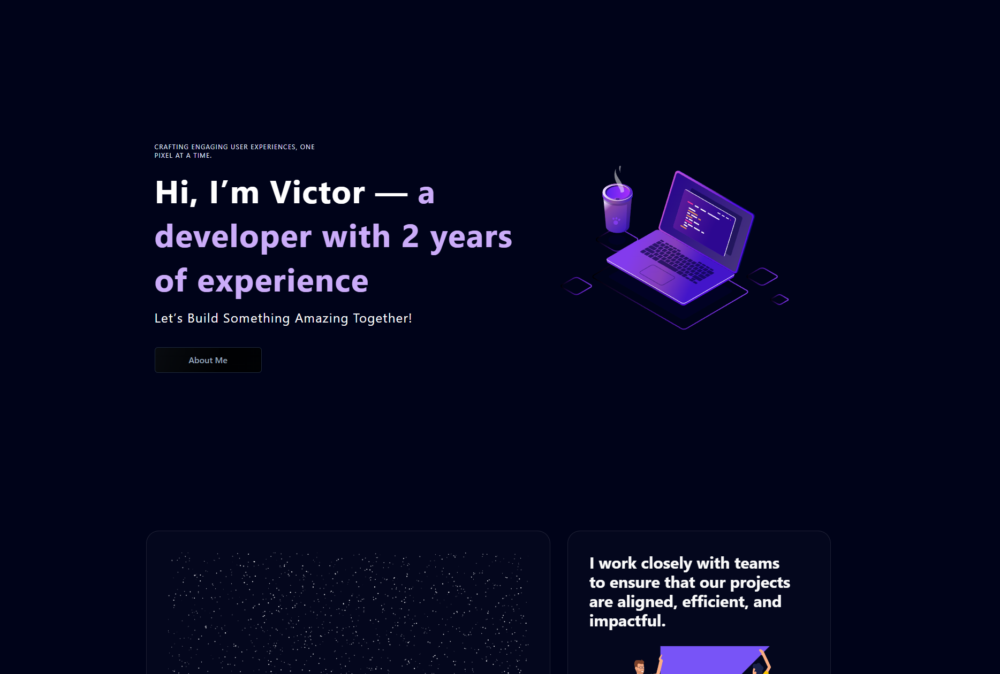

# Portfolio

This portfolio showcases my skills and projects as a frontend developer. Built using Next.js for server-side rendering and performance optimization, Tailwind CSS for responsive and modern styling, and Aceternity UI for customizable components, it reflects my expertise in modern web development.



## TechStack

- Nextjs
- Typescript
- Tailwind CSS
- Aceternity UI
-

## Key Features

- Hero
- About Section
- Skill Section
- Project Section
- Footer

## Prerequisites

- Node.js
- npm or yarn or pnpm or bun for package management

## Installation

1. Clone the repository

```bash
https://github.com/vjvic/victor-portfolio.git

```

2.  Navigate to project directory

```bash
cd anivault

```

3. Install the dependencies:

```bash
npm install

```

## Usage

1. Start the development server

```bash
npm run dev

```

2. Access the application in your browser at http://localhost:3000.
